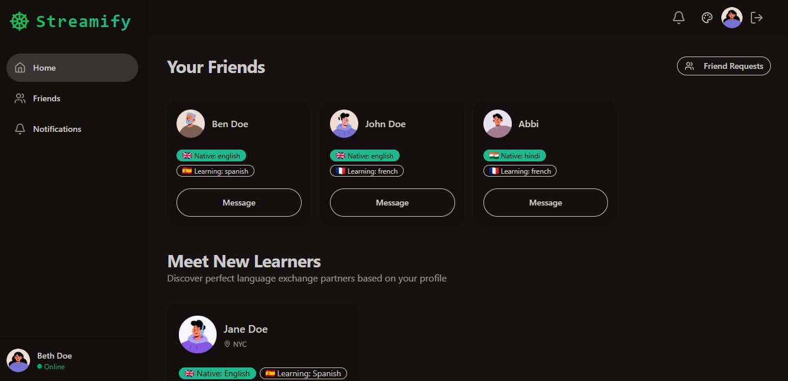
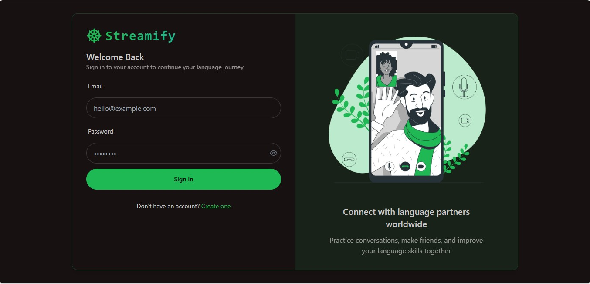
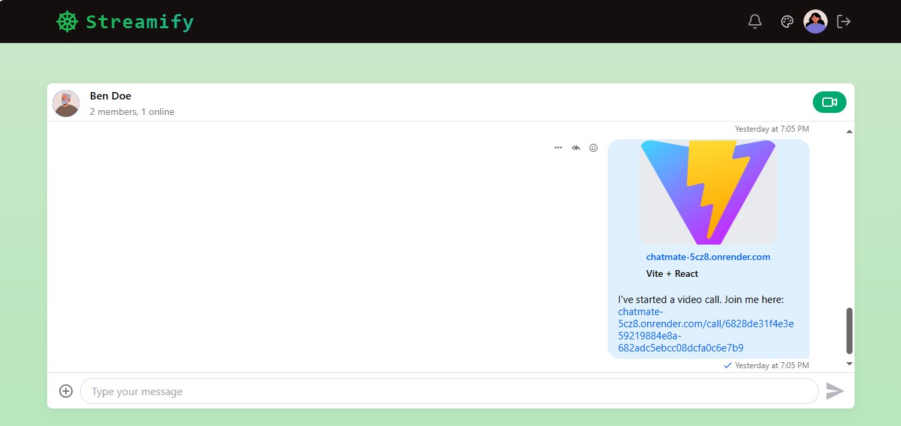

# ✨ Streamify — Fullstack Chat & Video Calling App ✨

Welcome to **Streamify**, a powerful language exchange platform with built-in chat and video calling! Practice languages, connect with new people, and engage in meaningful conversations in real time.

## 🚀 Demo

Live Demo: \[https://chatmate-5cz8.onrender.com/login]

---

## 🔥 Highlights

* 🌐 Real-time Messaging with Typing Indicators & Emoji Reactions
* 📹 1-on-1 and Group Video Calls with Screen Sharing & Recording
* 🗣️ Language Exchange Platform Matching Native & Learning Languages
* 🧑‍🎨 32 Unique UI Themes for Personalization
* 🔐 JWT Authentication with Protected Routes
* 🌍 Multilingual Interface Support
* ⚡ **Tech Stack:** React + Express + MongoDB + TailwindCSS + TanStack Query
* 🧠 Global State Management using Zustand
* 🚨 Robust Error Handling (Frontend & Backend)
* ☁️ Free Deployment via Render or Vercel
* 🎯 Built with Scalable APIs like Stream for Chat & Video
* 🧪 Environment-Based Configuration

---

## 📸 Screenshots

### 🧑‍🤝‍🧑 Friends Dashboard & Suggestions



### 🔐 Login Page



### 💬 Messaging Interface with Video Call



> *Make sure to place the image files in the `/screenshots` folder in your repo.*

---

## 🛠️ Environment Variables

### Backend (`/backend`):

```env
PORT=5001
MONGO_URI=your_mongo_uri
STREAM_API_KEY=your_stream_api_key
STREAM_API_SECRET=your_stream_api_secret
JWT_SECRET_KEY=your_jwt_secret
NODE_ENV=development
```

### Frontend (`/frontend`):

```env
VITE_STREAM_API_KEY=your_stream_api_key
```

---

## ⚙️ Run the Project

### 🔧 Backend Setup

```bash
cd backend
npm install
npm run dev
```

### 💻 Frontend Setup

```bash
cd frontend
npm install
npm run dev
```

---

## 📦 Folder Structure

```
streamify/
├── backend/
│   └── ... Express + MongoDB + JWT + Stream APIs
├── frontend/
│   └── ... React + Zustand + TailwindCSS + TanStack Query
├── screenshots/
│   └── friends.png, login.png, chat.png
└── README.md
```

---

## 🧠 Features in Detail

* **User Authentication**: Sign up, log in, and securely manage sessions
* **Dynamic Friend Suggestions**: AI-based learner-native pairing
* **Global Chat System**: Real-time communication with Stream SDK
* **Video Calling**: HD video chat with WebRTC support
* **Dark Mode Interface**: Elegant UI design with theme switcher
* **User Profiles**: See native/learning languages, time zones, activity

---

## ✨ Technologies Used

* **Frontend:** React, TailwindCSS, Zustand, TanStack Query, Vite
* **Backend:** Express.js, MongoDB, JWT, Stream API
* **Other Tools:** Socket.io, WebRTC, React Hook Form, Vercel, Render

---

## 📬 Contact / Contribute

Contributions and feedback are welcome!

> *Have an idea or improvement? Open a pull request or create an issue.*

---

## 📄 License

This project is licensed under the [MIT License](./LICENSE).

---

### Made with ❤️ for global language learners.
